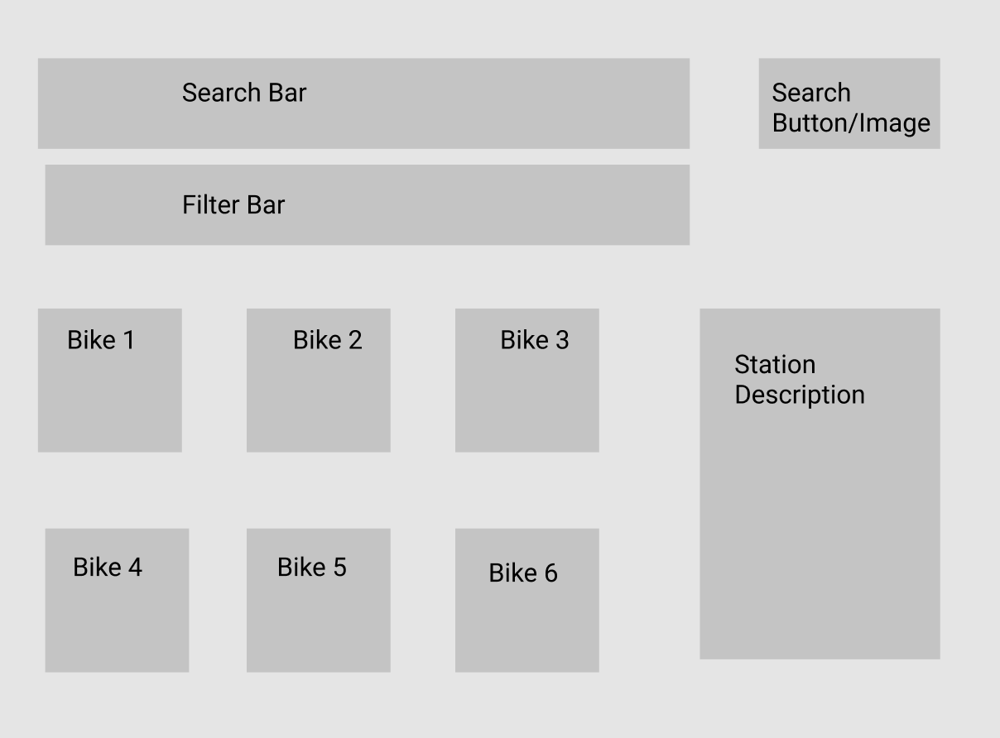

* https://en.wikipedia.org/wiki/Haversine_formula
* https://stackoverflow.com/questions/18883601/function-to-calculate-distance-between-two-coordinates


## What is your application?
1. Problem: 
* The need for biking to slowly enjoy the cities are increasing 
* Bikes station are scattered everywhere, and tourists need to know the closest one to be there as soon as possible
2. Solution:
* Show the nearest city bike station when the user inputs the address/zip code/ coordinates and also return the station information

## What 3rd party API are you going to use?
* https://github.com/eskerda/pybikes
* http://api.citybik.es/v2/? fbclid=IwAR2TpUUAClRbMLAOWrN-AZFrA6fruZ7onCNNOOZdvBMFhK4APzWmvc2X18Y
* http://api.citybik.es/v2/networks

## Tentative Technology:
Calculate distance based on the coordinates
Return the closest available bikes and docks
Having multiple filters (name, system, company, etc.)

## Wireframe

## Expected roadblocks
* Time (of course)
* Other/Overdue assignment to do until the 30th (Thursday)
* Work at the current startup and Scrum certificate lesson daily
* Job applications

## Timeframe/Schedule
* Tuesday, Wednesday, Friday: design the application's logic
* Saturday, Sunday: design the app's visualization

## Sample API block
Capital BikeShare instantiation data is in bixi.json file
`>>> capital_bikeshare = pybikes.get('capital-bikeshare')

* The instance contains all possible metadata regarding this system
>>> print(capital_bikeshare.meta)
`{
    'name': 'Capital BikeShare',
    'city': 'Washington, DC - Arlington, VA',
    'longitude': -77.0363658,
    'system': 'Bixi',
    'company': ['PBSC'],
    'country': 'USA',
    'latitude': 38.8951118
}
* The update method retrieves the list of stations
>>> print(len(capital_bikeshare.stations))
0
>>> capital_bikeshare.update()
>>> print(len(capital_bikeshare.stations))
191
>>> print(capital_bikeshare.stations[0])
--- 31000 - 20th & Bell St ---
bikes: 7
free: 4
latlng: 38.8561,-77.0512
extra: {
    'installed': True,
    'uid': 1,
    'locked': False,
    'removalDate': '',
    'installDate': '1316059200000',
    'terminalName': '31000',
    'temporary': False,
    'name': '20th & Bell St',
    'latestUpdateTime': '1353454305589'
}
